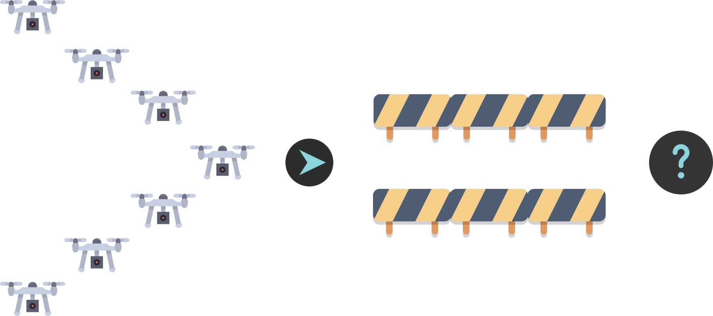
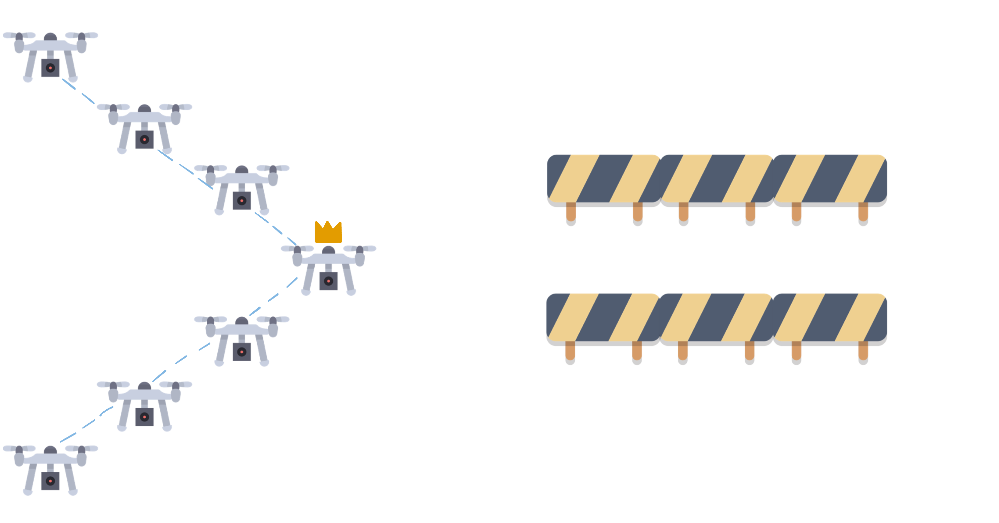

+++

title = "Integration of Control Lyapunov and Control Barrier Functions for Safety-Critical Guarantees in Aggregate Computing"
description = "Presentation slides for talk on CLF and CBF in Aggregate Computing."
outputs = ["Reveal"]

+++

# Integration of Control Lyapunov and Control Barrier Functions for Safety-Critical Guarantees in Aggregate Computing

[**Angela Cortecchia**](mailto:angela.cortecchia@unibo.it)

---

### How will the drones avoid the obstacle?

---

### A possible approach to the obstacle

### BUT THEY LOST FORMATION!

---

### What could happen by losing the formation?

---





# Base<small>1</small>

{}

{}

### first col

<ul>
    <li class="fragment" data-fragment-index=0>who</li>
    <li class="fragment" data-fragment-index=1>are</li>
    <li class="fragment" data-fragment-index=2>them</li>
</ul>
{}

{}
### second col 

<ul>
    <li class="fragment" data-fragment-index=0>pippo</li>
    <li class="fragment" data-fragment-index=1>pluto</li>
    <li class="fragment" data-fragment-index=2>paperino</li>
</ul>

{}

{}

<small style="text-align: left"> 
[1] Beal, J., Pianini, D., Viroli, M. "Aggregate Programming for the Internet of Things." 2015. 
</small>



<!--
In control theory,
there exist formal methods that allow us to specify conditions for both achieving a desired objective (stability) and
ensuring that the system remains within safe operating regions (safety).
These conditions can be expressed through well-defined mathematical functions that act as certificates in the assumption that the model captures the reality well.

Aggregate Computing already provides formal tools and stability guarantees,
for instance through self-stabilizing constructs and Lyapunov-based analysis.
However, these guarantees are eventual: they ensure convergence, but do not control the transient behavior.
As a result, in safety-critical scenarios (e.g., robotics), the system may temporarily enter unsafe regions during adaptation.

Control Lyapunov Functions and Control Barrier Functions provide a principled way to express stability and safety requirements
through mathematical conditions that can be verified and enforced at runtime.
By integrating those requirements into Aggregate Computing,
we introduce a layer in which safety-critical conditions can be specified,
checked, and maintained directly at the collective level, enabling predictable and robust execution of distributed adaptive systems.

In control theory, stability and safety can be formally specified through conditions and constraints.
Aggregate Computing provides eventual stability but cannot prevent transient unsafe behavior.
Control Lyapunov and Control Barrier Functions allow enforcing stability and safety at runtime.
Integrating them into Aggregate Computing would enable collective-level safety guarantees.
The talk will outline motivation, applications, and a possible integration path.

--- 

Domanda:

Se avessimo ad esempio uno sciame di droni in formazione a V e un'ostacolo esattamente nella loro traiettoria,
come eviteranno l'ostacolo?

**risposte dal pubblico**

potrebbe anche succedere che si scollega la connessione tra di loro e ognuno vada per conto suo

---
-->