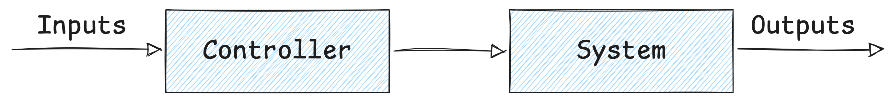
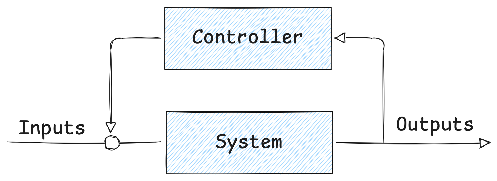
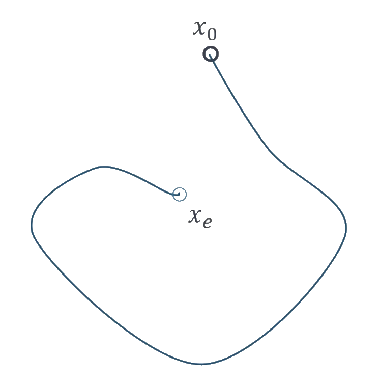
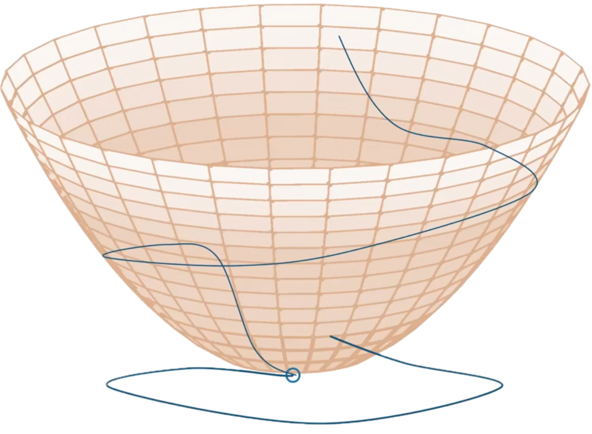
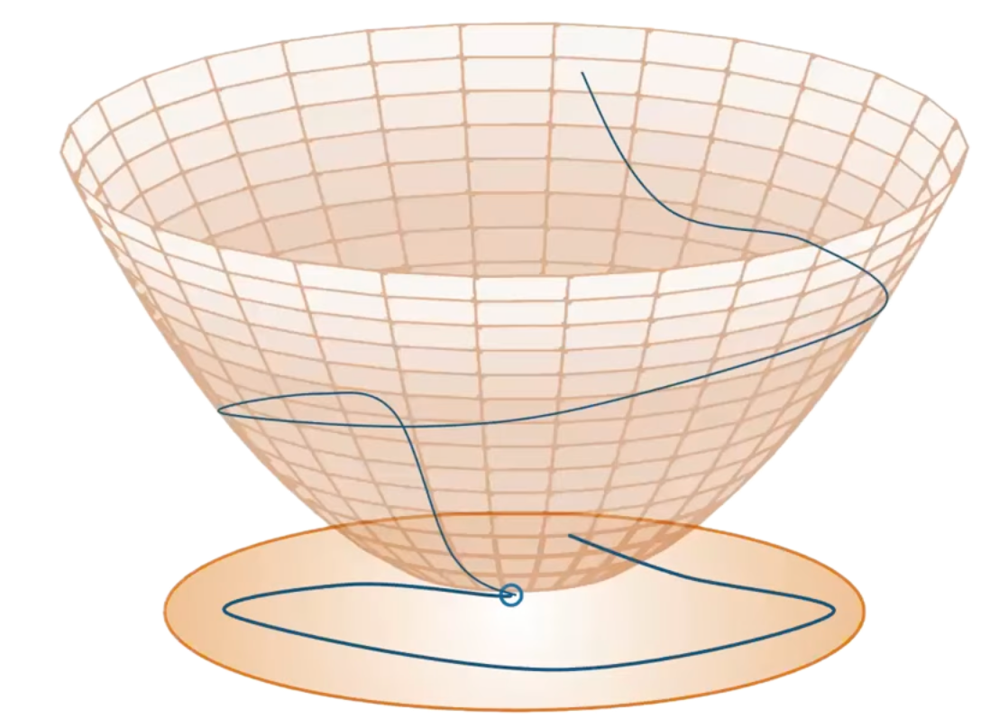
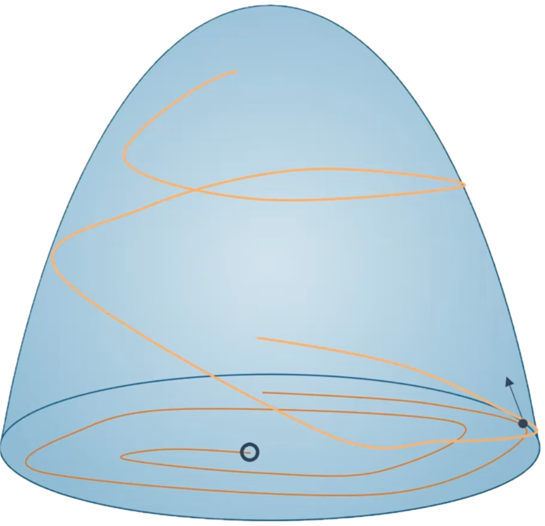
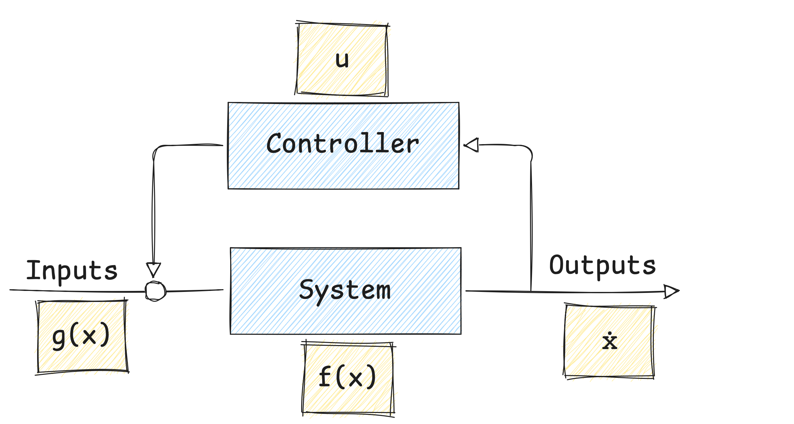

+++

title = "Integration of Control Lyapunov and Control Barrier Functions for Safety-Critical Guarantees in Aggregate Computing"
description = "Presentation slides for talk on CLF and CBF in Aggregate Computing."
outputs = ["Reveal"]
[params.reveal_hugo.katex]
enable = true

+++

# Integration of Control Lyapunov and Control Barrier Functions for **Safety-Critical Guarantees** in Aggregate Computing

### [**Angela Cortecchia**](mailto:angela.cortecchia@unibo.it)

---

# How will the drones avoid the obstacle?

---

# Current approach

{}
Potential issues:
- *eventual* consistency;
- loss of formation.
{}

---

# Eventual consistency

How much time will it take to re-form the formation?

---

# Eventual consistency

Potential issues on the transient behavior

---

# Possible consequences of losing the formation

- Lost connection
- New leaders
- Sub-formations going in different directions

---

# How we would like it to behave

Did not lose formation, neither connection, avoided the obstacle safely and keep going towards their goal.

---

# Our goal

Ensure guarantees on the transient behavior of the system, not only on the eventual one.

---

# How can we achieve it?

In control theory, there exist formal methods to specify both stability and safety conditions:
- *Control Lyapunov Functions* (CLF) for **fast convergence** and **stability**;
- *Control Barrier Functions* (CBF) for **safety** in the transient behavior.

---

# Preliminaries: **Control Theory**

*Control Theory* is a branch of engineering and mathematics that deals with the behavior of dynamical systems with inputs (*controls*). \
The main goal is to develop *control strategies* that *modify the system's behavior to achieve a desired state*,
while minimizing delays or errors, while ensuring safety and control stability.  

Control can only be applied with respect to the system’s *temporal evolution*.

A *Control Loop* is a feedback-driven mechanism that measures the current state of a system, 
*compares* it to a desired set-point, 
and *automatically adjusts the control input* to minimize the error between the two.

---

# Preliminaries: **Open and closed loop controls**

An *automatic control system* can operate in two ways: as an *open-loop* control or as a *feedback (closed-loop) control*.

{}
{}

#### Open-Loop Control

The control *input* is determined *without considering the current state* of the system. \
It relies on predefined control actions based on a model of the system.

{}
{}
#### Feedback / Closed-Loop Control

The control input is *continuously adjusted* based on the current state of the system. \
It uses feedback from the system to correct deviations from the desired state.

{}
{}

{}
{}

\
\

{}
{}

{}
{}

---

# Preliminaries: **Lyapunov Theory**

{}
{}

*Lyapunov Theory* provides tools to analyze the *stability* property of dynamical systems. \
An autonomous dynamical system without a control input is described by the equation \
$\dot{x} = f(x)$

Starting from an initial state $x_0$, 
there exist some trajectory from there, and we want to verify whether the system converges to a desired equilibrium point $x_e$.

{}
{}

{}
{}

---

# Preliminaries: **Lyapunov Theory**




If we can devise a Lyapunov function $V(x)$ that satisfies: 
<ul>
    <li>$s.t. V(x_e) = 0, V(x) > 0 for x \neq x_e$,</li>
    <li>$\dot{V}(x) = \frac{\partial V}{\partial x} f(x) < 0$ for $x \neq x_e$,</li>
</ul>

The evolution of the Lyapunov function over time will decrease towards $x_e$.  
This implies that the system is stable and will converge to the desired equilibrium point.

Every positive level set of the Lyapunov function is an <em>invariant set</em>
$\Omega = \left\{ x \mid V(x) \le c \right\}$.  
If you start within that set, your trajectory will remain inside it for all future time.




  <!-- First image: visible when the slide loads, then fades out when the first fragment step is triggered -->
  

  <!-- Second image: hidden at first, appears exactly when the first image fades out -->
  

  <!-- Third image: appears on the next fragment step -->
  




---

# Preliminaries: **Nagumo's Invariance Theorem**

Given a different function $\dot{x} = f(x)$ and a different trajectory:

Our goal is to ensure that the trajectory remains within a region of interest.

---

# Preliminaries: **Nagumo's Invariance Theorem**




Given a function $h(x)$, the safe region (space of states we want to remain in) is:

$\mathcal{C} = \{ x \mid h(x) \geq 0 \}$ → <em>super zero level set of $h$</em>

To guarantee that trajectories never leave $\mathcal{C}$ (safety), it is enough to ensure that, on its boundary:  
$\dot{h}(x) \geq 0 \forall x \in \partial \mathcal{C}$  

If the condition holds, $\mathcal{C}$ is <em>forward invariant</em>: 
once inside, the system will always remain inside the safe region.




  
  




---

# Preliminaries: **Control-Affine Systems**

A **Control-Affine System** is a *dynamical* system described by the equation:

$\dot{x} = f(x) + g(x)u$

where:
- $x \in \mathbb{R}^n$ is the *state vector* (position, velocity, etc.),
- $u \in \mathcal{U} \subset \mathbb{R}^m$ is the *control input* (input, actuator commands, etc.),
- $f: \mathbb{R}^n \to \mathbb{R}^n$ is the *drift vector field* (the natural evolution of the system without control),
- $g: \mathbb{R}^n \to \mathbb{R}^{n \times m}$ is the *control input matrix* (how the control input affects the system).

---

# Preliminaries: **Lie Derivatives**

The *Lie Derivative* of a differential scalar function $h: \mathbb{R}^n \to \mathbb{R}$ along a vector field $f: \mathbb{R}^n \to \mathbb{R}^n$ is defined as:

$L_f h(x) = \frac{\partial h}{\partial x} f(x) = \nabla h(x) \cdot f(x)$

It represents how $h(x)$ changes in time as the state evolves according to the system dynamics.

For a Control-Affine System $\dot{x} = f(x) + g(x)u$, the time derivative of $h(x)$ is:

$\dot{h}(x, u) = L_f h(x) + L_g h(x) u$

where:
- $L_f h(x)$ is the Lie Derivative of $h$ along $f$ (drift term),
- $L_g h(x)$ is the Lie Derivative of $h$ along $g$ (control term),
- $u$ is the control input.

*This notation captures how $h(x)$ evolves due to both natural dynamics and control input over time.*

---

# Control **Lyapunov** Functions (CLF)

A continuously differentiable function $V: \mathbb{R}^n \to \mathbb{R}_{\geq 0}$ \
is a *Control Lyapunov Function* for the target set $\mathcal{X}_d \subseteq \mathbb{R}^n$ if:
1. $V(x) = 0$ for all $x \in \mathcal{X}_d$ and $V(x) > 0$ for all $x \notin \mathcal{X}_d$ (positive definiteness);
2. For all $x \notin \mathcal{X}_d$, there exists a control input $u \in \mathcal{U}$ such that for some constant $c > 0$ *:

$L_f V(x) + L_g V(x) u \leq -cV(x)$

{}

This condition ensures that $V(x(t))$ keeps decreasing over time, so the state $x(t)$ moves closer and closer to the desired target set $\mathcal{X}_d$.

In practice, this means we can drive the system toward its equilibrium, 
proving that the system is stabilizable through feedback control.

<small style="text-align: left">
* The constant $c > 0$ determines the rate of convergence; larger values lead to faster convergence.
</small>

---

# **CLF Example**: point stabilization

For a system $\dot{p} = u$
where we want to stabilize the position $p$ of a point at a desired location $p_d$.

We want to design a control input $u$ that drives $p$ towards $p_d$.

We then define:
- the CLF: $V(p) = \|\| p - p_d \|\|^2$
- the Lie Derivatives of $V$ along $f$ and $g$ respectively:
$L_f V(p)=0$$L_g V(p) = 2(p - p_d)$

Thus, $\dot{V}(p,u)=2(p-p_d)^\top u$which links the control input $u$ to the rate of change of $V$.

Choosing a control input $u$ such that:

$u=-k(p-p_d)$ for some $k > 0$ ensures that
$\dot{V} = -2k \|\| p - p_d \|\|^2 \leq 0$

Which guarantees that $V(p)$ decreases exponentially over time, 
driving $p$ towards $p_d$ and stabilizing the system at the desired point.

---

# Control **Barrier** Functions (CBF)

A continuously differentiable function $h: \mathbb{R}^n \to \mathbb{R}$ is a *Control Barrier Function* for the safe set 

$\mathcal{C} = \{ x \mid h(x) \geq 0 \}$

We want $\mathcal{C}$ to be forward invariant, i.e., if the system starts or enters in $\mathcal{C}$, it remains in $\mathcal{C}$ for all future time.

Given that:
an *extended class-$\mathcal{K}$* function is a continuous, strictly increasing function \
defined on an interval including negative values, with $\alpha(0) = 0$.

And that the ''zeroing'' CBF condition requires an $\alpha \in \mathcal{K}_e$ such that $\forall x \in \mathcal{D} \supset \mathcal{C} \rightarrow \exists u \in \mathcal{U}$ with:

$L_f h(x) + L_g h(x) u + \alpha(h(x)) \geq 0$

This condition ensures  
$\dot{h}(x,u) \geq - \alpha(h(x))$
which implies forward invariance of $\mathcal{C}$, \
preventing the system from entering unsafe regions.

---

# **CBF Example**: collision avoidance

For two agents $i, j$ with positions $p_i, p_j \in \mathbb{R}^d$, we define: 

$h_{ij}(p) = \|\| p_i - p_j \|\|^2 - D^2$  where $D$ is the minimum safe distance between them.

The safe set is:  $\mathcal{C}_{ij} = \{ p \mid h_{ij}(p) \geq 0 \}$

Then we'll compute the Lie Derivatives of $h_{ij}$ along $f$ and $g$ respectively:

$L_f h_{ij}(p) = 0$, $L_g h_{ij}(p)[u_i;u_j] = 2(p_i - p_j)^\top(u_i-u_j)$

To ensure collision avoidance, we need to find control inputs $u_i, u_j$ such that: \
$2(p_i - p_j)^\top(u_i-u_j) + \alpha(h_{ij}(p)) \geq 0$

---

# CLF-CBF-**Quadratic Program**

To get a control input that satisfies both CLF and CBF conditions,
in order to enforce both stability and safety, \
we can use them as constraints in a quadratic optimization problem.

$\underset{u,s \ge 0}{\min} \|\| u - u_{des} \|\| + ws^2$

$s.t. \quad L_f V(x) + L_g V(x)u \leq -c V(x) + s$,

$L_f h_\ell(x) + L_g h_\ell(x) u + \alpha(h_\ell(x)) \ge 0 \quad \forall \ell$

Where:
- $u_{des}$ is a desired control input in the absence of constraints;
- $s$ is a slack variable to relax the CLF constraint when necessary (to prioritize safety);
- $w$ is a weight to penalize the slack variable;
- $\ell$ indexes multiple CBF constraints.

The CLF is softened to ensure feasibility, while CBFs are enforced strictly to guarantee safety.

*The QP is solved at each time step to compute the control input $u$ that balances stability and safety, \
while minimizing deviation from the desired input.*

---

# Research question(**s**)

- How to integrate CLF and CBF in Aggregate Computing?
- How to specify safety-critical requirements both at the *single* and the *collective* level?
- How to enforce safety and stability guarantees during the transient behavior of distributed adaptive systems?

---

# How to **integrate** CLF and CBF in AC?

{}
Nice question, next.
{}

---

# How to **integrate** CLF and CBF in AC?

- Use AC to define the desired collective behavior and objectives, as usual;
- Collect neighbor information and local states at each device;
- Formulate local CLF and CBF conditions based on the collective objectives and safety requirements;
- At each device, solve a local QP that incorporates the CLF and CBF constraints to compute the control input;
- Apply the computed control input to the device's actuators;
- Broadcast the control input and state information to neighbors for the next round of computationl.

---

# Overview

{}
{}

### Benefits of the integration

- Formal specification of safety and stability requirements at the collective level.
- Making safety-critical guarantees an integral part of the Aggregate Computing model.
- Safety and convergence are enforced by QP solvers at each device, ensuring local adherence to global requirements.
- Possible guarantees on transient behavior, not only eventual consistency.

{}
{}

### Possible challenges-limitations

- Computational overhead of solving QPs on resource-constrained devices.
- Asynchrony and communication delays must be considered in the control design.

{}
{}

---

# Aggregate Computing + CLF + CBF use cases

Formal mechanism to guarantee safety properties, e.g.:
- Obstacle avoidance while maintaining formation;
- Collision avoidance between agents;
- Safe navigation in dynamic environments;
- Staying inside a designated area;
- Maintaining sufficient network connectivity;
- Respecting density limits in regions of interest.

---

# Suggestions?

[//]: # (![Drones avoiding obstacle while keeping formation]&#40;./images/drones_avoiding_formation.png&#41;)

<!--
In control theory,
there exist formal methods that allow us to specify conditions for both achieving a desired objective (stability) and
ensuring that the system remains within safe operating regions (safety).
These conditions can be expressed through well-defined mathematical functions that act as certificates in the assumption that the model captures the reality well.

Aggregate Computing already provides formal tools and stability guarantees,
for instance through self-stabilizing constructs and Lyapunov-based analysis.
However, these guarantees are eventual: they ensure convergence, but do not control the transient behavior.
As a result, in safety-critical scenarios (e.g., robotics), the system may temporarily enter unsafe regions during adaptation.

Control Lyapunov Functions and Control Barrier Functions provide a principled way to express stability and safety requirements
through mathematical conditions that can be verified and enforced at runtime.
By integrating those requirements into Aggregate Computing,
we introduce a layer in which safety-critical conditions can be specified,
checked, and maintained directly at the collective level, enabling predictable and robust execution of distributed adaptive systems.

In control theory, stability and safety can be formally specified through conditions and constraints.
Aggregate Computing provides eventual stability but cannot prevent transient unsafe behavior.
Control Lyapunov and Control Barrier Functions allow enforcing stability and safety at runtime.
Integrating them into Aggregate Computing would enable collective-level safety guarantees.
The talk will outline motivation, applications, and a possible integration path.

--- 

Domanda:

Se avessimo ad esempio uno sciame di droni in formazione a V e un'ostacolo esattamente nella loro traiettoria,
come eviteranno l'ostacolo?

**risposte dal pubblico**

potrebbe anche succedere che si scollega la connessione tra di loro e ognuno vada per conto suo

---
-->